# System Overview Diagram - Documents Management System

## 1. High-Level Architecture

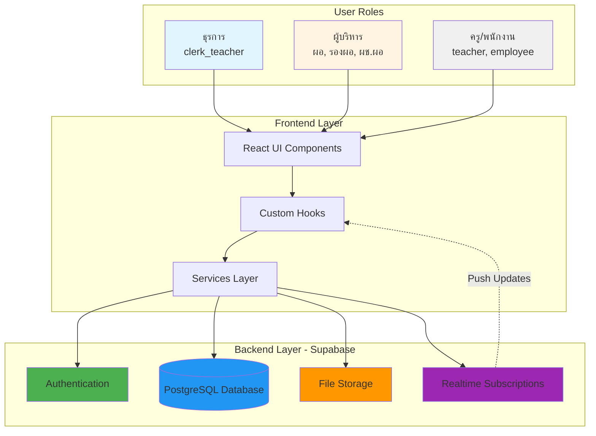

## 2. Database Schema Overview

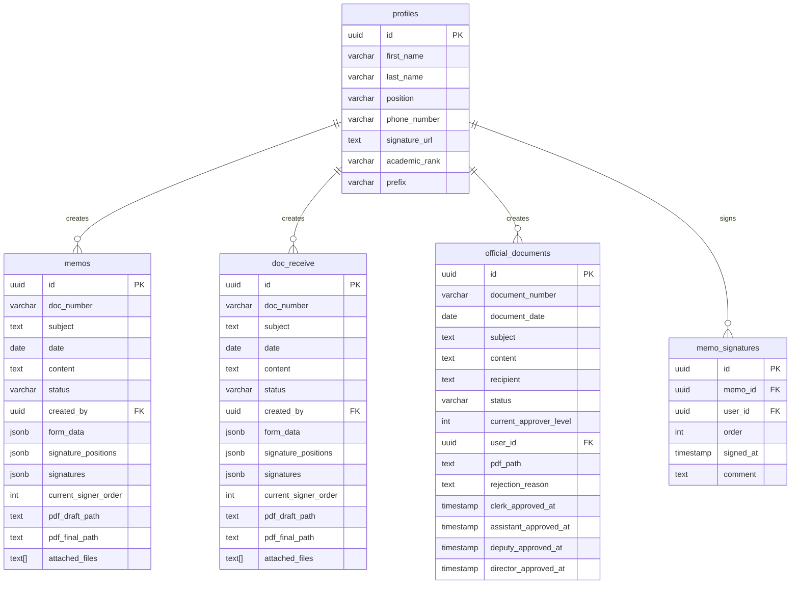

## 3. User Roles & Permissions Matrix

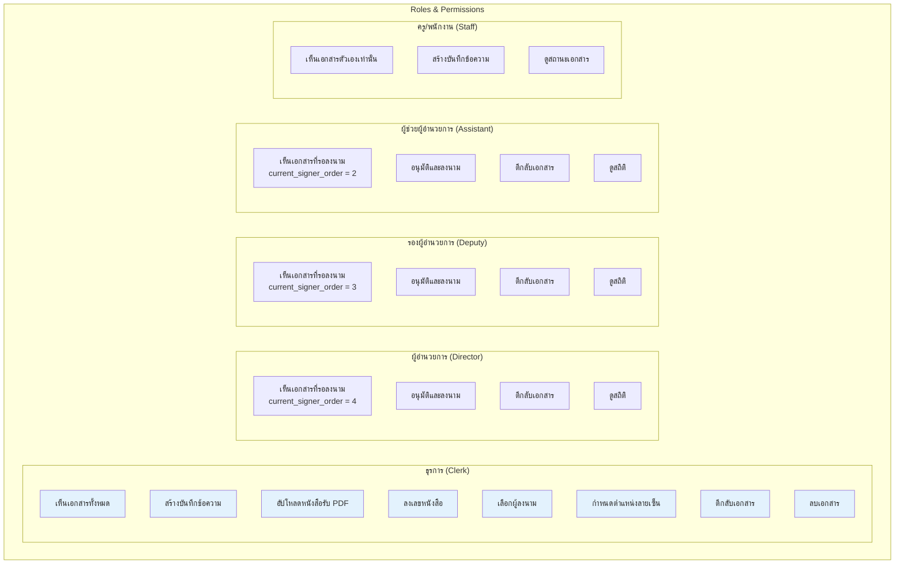

## 4. Document Types & Storage Structure

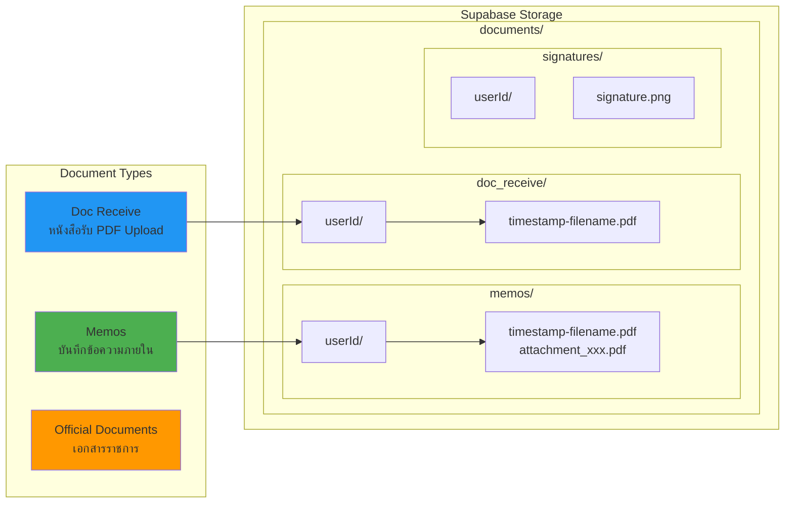

## 5. Component Architecture - Documents Feature

```mermaid
graph TB
    subgraph "Pages"
        ODP[OfficialDocumentsPage<br/>/documents]
        CDP[CreateDocumentPage<br/>/create-document]
        CMP[CreateMemoPage<br/>/create-memo]
        DMP[DocumentManagePage<br/>/document-manage/:id]
        ADP[ApproveDocumentPage<br/>/approve-document/:id]
        PSP[PDFSignaturePage<br/>/pdf-signature]
    end

    subgraph "Main Components"
        DC[DocumentCards]
        DL[DocumentList]
        DRL[DocReceiveList]
        PDL[PersonalDocumentList]
        PDC[PendingDocumentCard]
    end

    subgraph "Form Components"
        CMF[CreateMemoForm]
        SPF[SinglePDFSignatureForm]
    end

    subgraph "Document Management Components"
        S1[Step1DocumentNumber]
        S2[Step2SelectSigners]
        S3[Step3SignaturePositions]
        S4[Step4Review]
    end

    subgraph "Approval Components"
        AP[ApprovalProcess]
        AA[ApprovalAction]
        AS[ApprovalSteps]
    end

    subgraph "Utilities"
        PDFV[PDFViewer]
        SPS[SignaturePositionSelector]
    end

    ODP --> DC
    DC --> DL
    DC --> DRL
    DC --> PDL
    DC --> PDC

    CDP --> CMF
    CDP --> SPF

    CMP --> CMF

    DMP --> S1
    DMP --> S2
    DMP --> S3
    DMP --> S4

    S3 --> PDFV
    S3 --> SPS

    ADP --> AP
    AP --> AA
    AP --> AS
    ADP --> PDFV

    PSP --> SPF

    style ODP fill:#4CAF50
    style DMP fill:#2196F3
    style ADP fill:#FF9800
```

## 6. Data Flow Architecture

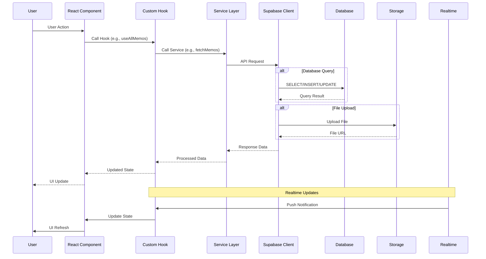

## 7. Authentication & Authorization Flow

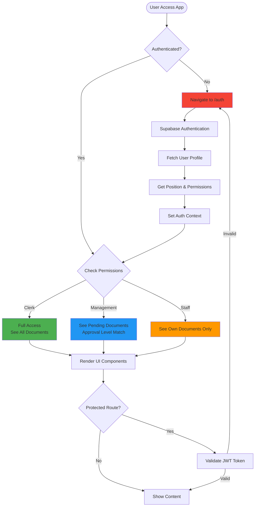

## 8. Status State Machine

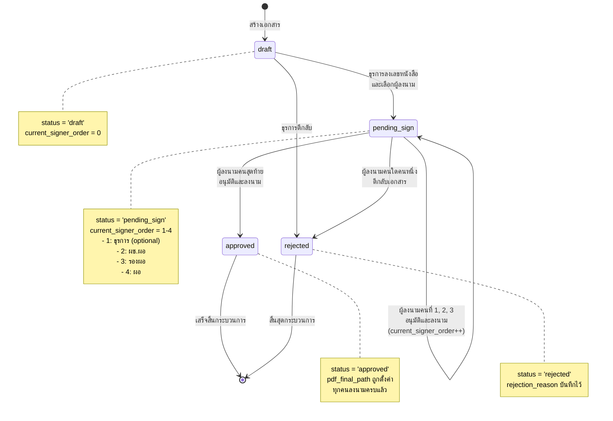

## 9. File Processing Pipeline

```mermaid
graph LR
    subgraph "Create Document"
        A1[User Uploads<br/>Attachments] --> A2[Upload to Storage<br/>documents/memos/userId/]
        A2 --> A3[Get File URLs]
        A3 --> A4[Generate PDF<br/>from Form Data]
        A4 --> A5[Save to<br/>pdf_draft_path]
    end

    subgraph "Signature Process"
        B1[Clerk Sets<br/>Signature Positions] --> B2[Store positions<br/>in signature_positions[]]
        B2 --> B3[Signer 1<br/>Signs Document]
        B3 --> B4[Fetch Signature<br/>Image from Profile]
        B4 --> B5[Draw Signature<br/>on PDF using pdf-lib]
        B5 --> B6[Upload New PDF]
        B6 --> B7[Update<br/>pdf_draft_path]
        B7 --> B8{More Signers?}
        B8 -->|Yes| B3
        B8 -->|No| B9[Set pdf_final_path]
    end

    subgraph "Merge with Attachments"
        C1[Get Main PDF] --> C2[Get All Attachments]
        C2 --> C3[Merge PDFs<br/>using pdf-lib]
        C3 --> C4[Upload Final PDF]
        C4 --> C5[Update Record]
    end

    A5 --> B1
    B9 --> C1

    style A4 fill:#4CAF50
    style B5 fill:#2196F3
    style C3 fill:#FF9800
```

## 10. Realtime Update Flow

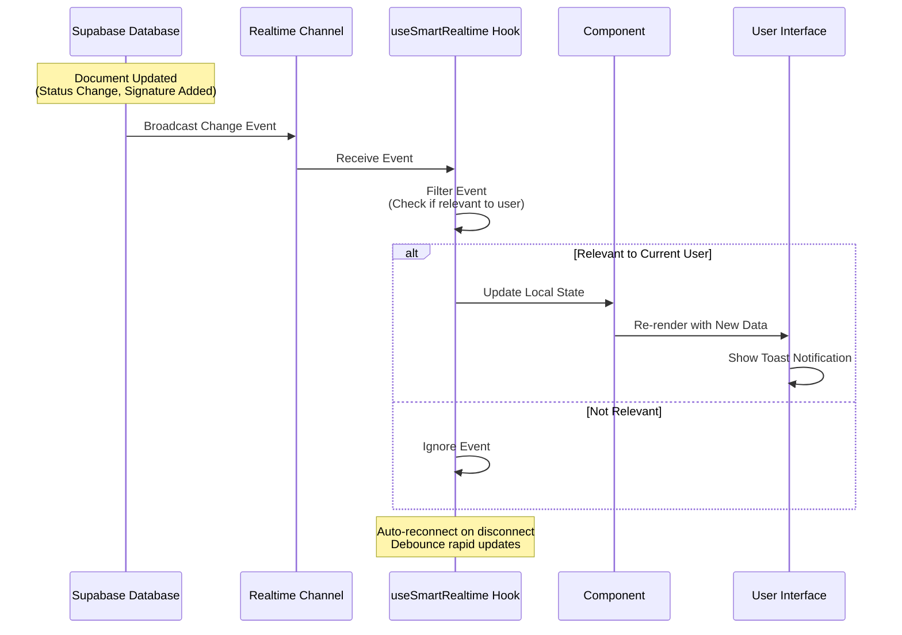

## 11. API Service Layer Architecture

```mermaid
graph TB
    subgraph "Services"
        ODS[officialDocumentService.ts]
        MS[memoService.ts]
        PS[profileService.ts]
        NS[notificationService.ts]
    end

    subgraph "officialDocumentService"
        ODS1[fetchOfficialDocuments<br/>Filter by role]
        ODS2[fetchMemos<br/>Get all memos 30 days]
        ODS3[fetchMemoPDFFiles<br/>From storage]
        ODS4[rejectDocument<br/>Update status]
        ODS5[assignDocumentNumber<br/>Set doc_number]
        ODS6[setDocumentForSigning<br/>Set signers]
        ODS7[uploadNewPDF<br/>Upload to storage]
        ODS8[downloadPDF<br/>Download from storage]
    end

    subgraph "MemoService Class"
        MS1[uploadAttachedFiles<br/>Upload to storage]
        MS2[createMemoDraft<br/>Create record]
        MS3[updateMemo<br/>Update record]
        MS4[submitMemoForApproval<br/>Change status]
        MS5[submitPDFSignature<br/>Add signature to PDF]
        MS6[getMemoById<br/>Get single memo]
    end

    subgraph "Supabase Client"
        SC[supabase.from<br/>supabase.storage<br/>supabase.auth]
    end

    ODS --> ODS1
    ODS --> ODS2
    ODS --> ODS3
    ODS --> ODS4
    ODS --> ODS5
    ODS --> ODS6
    ODS --> ODS7
    ODS --> ODS8

    MS --> MS1
    MS --> MS2
    MS --> MS3
    MS --> MS4
    MS --> MS5
    MS --> MS6

    ODS1 --> SC
    ODS2 --> SC
    ODS3 --> SC
    ODS4 --> SC
    ODS5 --> SC
    ODS6 --> SC
    ODS7 --> SC
    ODS8 --> SC

    MS1 --> SC
    MS2 --> SC
    MS3 --> SC
    MS4 --> SC
    MS5 --> SC
    MS6 --> SC

    style ODS fill:#4CAF50
    style MS fill:#2196F3
    style SC fill:#FF9800
```

## 12. Technology Stack

```mermaid
graph TB
    subgraph "Frontend"
        React[React 18.3.1]
        TS[TypeScript 5.x]
        Vite[Vite 6.x]
        TW[Tailwind CSS]
        Radix[Radix UI]
        RQ[React Query v5]
        RHF[React Hook Form]
        Zod[Zod Validation]
    end

    subgraph "PDF Libraries"
        PDFLIB[pdf-lib<br/>PDF manipulation]
        PDFJS[pdfjs-dist<br/>PDF rendering]
        RPV[@react-pdf-viewer<br/>PDF viewer UI]
    end

    subgraph "Backend - Supabase"
        SBAUTH[Supabase Auth<br/>JWT-based]
        SBDB[PostgreSQL<br/>Database]
        SBSTOR[Supabase Storage<br/>File storage]
        SBRT[Realtime<br/>WebSocket]
    end

    subgraph "Development Tools"
        ESL[ESLint]
        Prettier[Prettier]
        Git[Git]
    end

    React --> TS
    React --> TW
    React --> Radix
    React --> RQ
    React --> RHF
    RHF --> Zod

    React --> PDFLIB
    React --> PDFJS
    React --> RPV

    React --> SBAUTH
    React --> SBDB
    React --> SBSTOR
    React --> SBRT

    style React fill:#61dafb
    style SBDB fill:#3ecf8e
    style PDFLIB fill:#ff6b6b
```

## 13. Deployment & Environment

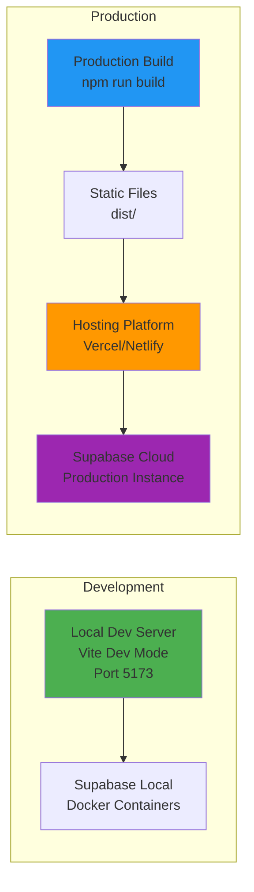

---

## สรุป System Overview

### Core Features:
1. **Multi-role Document Management** - ธุรการ, ผู้บริหาร 3 ระดับ, ครู/พนักงาน
2. **Digital Signature Workflow** - ลงนามแบบต่อเนื่อง (Chain signing)
3. **PDF Processing** - สร้าง, รวม, แก้ไข PDF
4. **Realtime Updates** - อัปเดทสถานะแบบ real-time
5. **Role-based Access Control** - จำกัดสิทธิ์ตาม position
6. **File Storage** - จัดเก็บเอกสารและไฟล์แนบ

### Key Technologies:
- **Frontend**: React + TypeScript + Tailwind CSS
- **Backend**: Supabase (PostgreSQL + Storage + Auth + Realtime)
- **PDF**: pdf-lib + pdfjs-dist + @react-pdf-viewer
- **State Management**: React Query (TanStack Query)

### Document Flow Summary:
```
Create → Draft → Assign Number → Select Signers → Position Signatures
→ Pending Sign → Sign (ผช.ผอ) → Sign (รองผอ) → Sign (ผอ) → Approved
```
